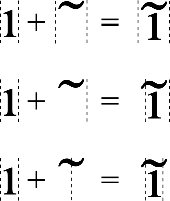

# Spacing Attachment

This is a proposal to extend the OpenType standard to support spacing marks.

Spacing marks are marks considered to have extent. When attached to a base or
another mark, such marks cause the extent of the base to be adjusted to ensure
that the combined cluster includes the extent of the mark in its attached
position. For example, if a mark is attached such that it overhangs to the right
of the base, the advance
of the base is extended to include the extent of the mark, and the mark itself
is given a zero advance. Likewise if such a mark were attached such that the
origin of the positioned mark were to the left of the origin of the base,
the origin of the cluster would be shifted back to include the origin of
the mark, while the offset from the origin of the base would be equally adjusted
to keep it in its same relative position.

In addition, since the advance of the mark has been incorporated into the base,
the advance of the spacing mark is zeroed as it is attached. Any subsequent
changes of the offset or advance of the mark do not change any of the offset
or advance of the base.

## Changes

> Define LookupFlags 0x0040 as the `SpacingAttach` flag

The `SpacingAttach` flag has meaning in the context of Cursive, MarkToBase,
MarkToLigature and MarkToMark attachment type lookups. In each of these cases
the attaching glyph is treated as though it were a spacing mark, even in a
Cursive attachment. For all other lookup types, the flag is ignored.

## Rationale

Some shapers zero their marks. This means the advance of the mark is set to
zero. This makes it hard to have a mark contribute to the space of a cluster.
For those shapers that do not zero their marks, calculating the impact of an
overlapping attachment on the advance of the mark is problematic, otherwise the
font has the job of zeroing its marks.

This added semantic can be enabled to help resolve the calculations needed to
account for protruding diacritics and ensuring appropriate spacing with minimal
complexity.
